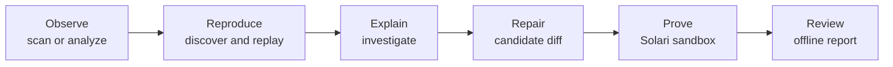

# FlakeLab documentation source

> Canonical product and documentation manuscript for FlakeLab. This file is the source brief for the public documentation site. Split it into focused MDX pages when designing the site, but keep the claims, commands, boundaries, and safety language intact.

## One-sentence description

FlakeLab finds, reproduces, explains, and proves fixes for flaky Playwright tests by combining deterministic fault experiments, bounded AI reasoning, and disposable Solari sandboxes.

## The problem FlakeLab solves

A flaky end-to-end test passes and fails without a relevant source change. A retry may make the build green, and a trace may show what happened during one failure, but neither proves why the outcome changed. Developers are left comparing noisy runs, increasing timeouts, or quarantining a test that may be exposing a real product race.

FlakeLab turns that uncertainty into a controlled experiment:

1. Observe the test repeatedly under normal conditions.
2. Introduce one bounded fault while running matched clean controls.
3. Minimize the smallest trigger that reliably changes the outcome.
4. Ask an AI investigator to compare competing explanations using compact evidence.
5. Generate one tightly constrained application-source patch.
6. Prove the candidate against hostile and clean trials in an isolated Solari microVM.
7. Return a reproducer, investigation, candidate diff, proof matrix, and offline HTML report for human review.

The principle is simple: **AI proposes; deterministic evidence decides.**

## What FlakeLab is-and is not

FlakeLab is:

- a CLI for Playwright test stability analysis;
- a deterministic fault-injection and trigger-minimization engine;
- an evidence-bounded AI investigator;
- a constrained application-source repair generator;
- an isolated proof runner built on Solari;
- a producer of portable, reviewable artifacts.

FlakeLab is not:

- a replacement for Playwright;
- a hosted test-history dashboard;
- a cross-browser device cloud;
- a general-purpose chaos engineering platform;
- an autonomous bot that edits the local checkout or opens a pull request;
- a reason to hide failures with retries, larger timeouts, or weaker assertions.

## Who it is for

FlakeLab is useful for developers, SDETs, and platform teams who already have Playwright tests and need to answer questions such as:

- Is this failure actually intermittent, consistently broken, skipped, or an infrastructure error?
- Does network timing, browser state, startup ordering, locale, viewport, animation, clock behavior, or suite concurrency cause it?
- What is the smallest reproducible trigger?
- Does the same failure signature appear under intervention and disappear under a matched control?
- Can a narrow source-code change remove the trigger without weakening the test?
- Which commit introduced the behavior?

## Product journey



`diagnose` is the recommended adaptive entry point. It starts with the cheapest useful operation, then always offers `Use Solari to prove a candidate fix? [y/N]` after an eligible interactive diagnosis. An affirmative answer is followed by a separate AI consent question. Both default to no, CI and piped runs never pause, and provider-backed work starts only after explicit approval. FlakeLab preflights both provider credentials before lengthy discovery begins and offers hidden, run-once paste prompts for missing keys.

## Installation and requirements

Requirements:

- Node.js 20 or newer;
- a Playwright project using `@playwright/test` 1.62.1;
- a locally installed Chromium browser for local execution;
- pnpm in projects whose setup depends on pnpm;
- `GROQ_API_KEY` only for AI investigation or repair;
- `SOLARI_API_KEY` only for isolated repair proof, publication, or statistical bisect.

Run without a global install:

```bash
npx flakelab@latest .
```

Or add it to a Playwright project:

```bash
pnpm add -D flakelab
pnpm exec flakelab doctor
```

FlakeLab uses the project's existing Playwright configuration. Tests continue to import `test` and `expect` from `@playwright/test`; no FlakeLab fixture or source edit is required.

## Five-minute quick start

Check the environment without running tests or consuming provider credits:

```bash
npx flakelab@latest doctor
```

Run the adaptive local diagnosis:

```bash
npx flakelab@latest diagnose tests/checkout.spec.ts
```

Ask FlakeLab to search for a causal fault and save a reproducer:

```bash
npx flakelab@latest discover tests/checkout.spec.ts \
  --fault network-delay \
  --pattern "**/api/checkout"
```

Verify that the saved trigger still causes the recorded failure signature:

```bash
npx flakelab@latest replay flakelab.repro.yaml
```

Run the complete provider-backed proof pipeline and open the resulting report:

```bash
npx flakelab@latest prove tests/checkout.spec.ts \
  --source src/checkout.ts \
  --open
```

The candidate is returned as `candidate.diff`. It is never applied to the local checkout automatically.

## Credentials and provider boundary

Credential lookup order is:

1. current process environment, including protected CI secrets;
2. a local `.env` file;
3. hidden interactive input kept in memory for the process lifetime.

There is deliberately no `--api-key` option because command arguments can appear in shell history and process listings. Use `--prompt-credentials` to ignore an outdated environment or `.env` value and enter a replacement once through hidden input.

Groq and Solari keys are stripped from the environment passed to Playwright subprocesses. Application-specific environment variables remain available to the test suite. Credentials are not stored in FlakeLab evidence and are not injected into proof sandboxes.

## Command map

| Command       | Provider use                 | Purpose                                                                   |
| ------------- | ---------------------------- | ------------------------------------------------------------------------- |
| `scan`        | None                         | Repeat a Playwright target under normal conditions and classify outcomes. |
| `analyze`     | None                         | Triage an existing Playwright blob report without rerunning tests.        |
| `doctor`      | None                         | Check runtime, Playwright, browser, privacy, and credential readiness.    |
| `diagnose`    | Optional                     | Start with evidence and run only the explicitly requested next phases.    |
| `discover`    | None                         | Search one fault family and minimize a deterministic trigger.             |
| `replay`      | None                         | Re-run a saved reproducer and verify its failure signature.               |
| `investigate` | Groq                         | Compare bounded hypotheses against experiments and write an assessment.   |
| `repair`      | Groq + Solari                | Generate a constrained source candidate and prove it in isolation.        |
| `prove`       | Groq + Solari                | Run discover, replay, investigate, repair, and report as one pipeline.    |
| `report`      | Solari only with `--publish` | Build one portable offline HTML evidence report.                          |
| `resume`      | Depends on pending phase     | Continue a checkpoint without repeating completed work.                   |
| `bisect`      | Solari                       | Statistically locate the revision that introduced a reproducer.           |

Run `flakelab --help` for the command map or `flakelab <command> --help` for command-specific help. `flakelab --version` and `flakelab -v` print the installed version.

## Command reference

### `scan`

```text
flakelab scan <target> [options]
flakelab <target> [options]
```

Runs the target repeatedly with Playwright retries disabled, using native `repeat-each` behavior and the JSON reporter. It classifies every selected test as `no-failure-observed`, `mixed-outcomes`, `failed-every-run`, `skipped`, or `errored` and writes `.flakelab/runs/scan.json` by default.

Options:

| Option              | Default          | Meaning                                                           |
| ------------------- | ---------------- | ----------------------------------------------------------------- |
| `--runs <number>`   | `4`              | Number of repetitions.                                            |
| `--concurrency <n>` | `1`              | Playwright workers. Increase only when shared resources are safe. |
| `--artifacts <dir>` | `.flakelab/runs` | Evidence directory.                                               |
| `--json`            | off              | Emit only the validated artifact JSON on stdout.                  |
| `--verbose`         | off              | Append artifact JSON to the human summary.                        |

Exit codes: `0` when no failure was observed, `1` for mixed or consistently failing outcomes, and `2` when infrastructure makes the sample inconclusive.

### `analyze`

```text
flakelab analyze <blob-report> [options]
```

Reads a Playwright blob-report ZIP or directory of shard archives. It validates archive structure and bounds, merges through Playwright's report merger, preserves the source archives, ranks failure signatures, and retains referenced traces, screenshots, and videos.

| Option                  | Default          | Meaning                                                   |
| ----------------------- | ---------------- | --------------------------------------------------------- |
| `--artifacts <dir>`     | `.flakelab/runs` | Evidence directory.                                       |
| `--baseline <artifact>` | none             | Rank signatures absent from an earlier analysis artifact. |
| `--json`                | off              | Emit only artifact JSON on stdout.                        |
| `--verbose`             | off              | Include artifact JSON after the summary.                  |

Example:

```bash
flakelab analyze ./blob-report --baseline previous.json --json
```

### `doctor`

```text
flakelab doctor
```

Checks Node.js, Playwright configuration, Chromium availability, whether evidence paths are ignored, provider credential presence, and credential isolation. It reports whether a credential exists and where it came from, never its value or a fingerprint.

### `diagnose`

```text
flakelab diagnose [test] [options]
```

This is the primary user journey. A test target begins with a bounded scan; `--report` begins with read-only blob-report analysis. The command writes `.flakelab/runs/diagnose.json` atomically after every phase so interrupted work can be resumed.

After an eligible interactive diagnosis, FlakeLab asks `Use Solari to prove a candidate fix? [y/N]`. Pressing Enter stops after local diagnosis. Answering yes leads to `Use AI to investigate and generate the candidate? [y/N]`, then requests an approved source file when needed. Once both actions are approved, FlakeLab checks `GROQ_API_KEY` and `SOLARI_API_KEY` up front, offering hidden, run-once paste prompts for missing keys, and starts the bounded proof pipeline. Non-interactive and CI runs skip the prompts.

| Option                   | Default                       | Meaning                                                       |
| ------------------------ | ----------------------------- | ------------------------------------------------------------- |
| `--report <blob-report>` | none                          | Start from existing CI evidence.                              |
| `--baseline <artifact>`  | none                          | Compare report analysis with earlier evidence.                |
| `--runs <number>`        | `4`                           | Repetitions in the control scan.                              |
| `--discover`             | off                           | Run local paired controls and minimize a trigger.             |
| `--investigate`          | off                           | Explicitly enable bounded Groq investigation.                 |
| `--repair`               | off                           | Explicitly enable candidate generation and Solari proof.      |
| `--source <file>`        | none                          | Approve an application source file; repeat up to seven times. |
| `--evidence <path>`      | `flakelab.investigation.json` | Investigation artifact.                                       |
| `--reproducer <path>`    | `flakelab.repro.yaml`         | Reproducer artifact.                                          |
| `--patch <path>`         | `candidate.diff`              | Candidate diff.                                               |
| `--proof <path>`         | `flakelab.proof.json`         | Proof matrix.                                                 |
| `--html <path>`          | `flakelab.report.html`        | Portable report.                                              |
| `--open`                 | off                           | Open the generated report without prompting.                  |
| `--model <name>`         | `qwen/qwen3.8-27b`            | Groq model identifier.                                        |
| `--max-cost <usd>`       | `0.25`                        | Model spend ceiling checked before work starts.               |
| `--prompt-credentials`   | off                           | Re-enter required keys through hidden prompts.                |

Diagnosis also accepts experiment bounds including `--trials`, `--concurrency`, `--seed`, `--max-delay`, `--min-rate`, `--pattern`, `--max-seconds`, `--max-steps`, `--max-experiments`, and `--max-trials`.

When diagnosis starts from `--report`, provide a test target before requesting experiments; FlakeLab will not guess what to execute.

### `discover`

```text
flakelab discover <test> [options]
```

Runs matched-seed control and intervention trials, minimizes a fault boundary, independently confirms the result, and writes a strict YAML reproducer plus a JSON discovery sidecar.

Core options:

| Option              | Default               | Meaning                                                            |
| ------------------- | --------------------- | ------------------------------------------------------------------ |
| `--fault <family>`  | `network-delay`       | Fault family to search.                                            |
| `--pattern <glob>`  | `**/api/checkout`     | Request or document pattern for applicable faults.                 |
| `--trials <number>` | `4`                   | Trials per candidate batch.                                        |
| `--concurrency <n>` | `1`                   | Playwright workers per trial batch.                                |
| `--min-rate <rate>` | `0.7`                 | Requested intervention failure rate, greater than 0 and at most 1. |
| `--seed <number>`   | `1`                   | Deterministic seed.                                                |
| `--max-seconds <n>` | `300`                 | Elapsed-time ceiling for discovery.                                |
| `--output <path>`   | `flakelab.repro.yaml` | Reproducer path.                                                   |

Fault-specific bounds are listed in the fault catalog below.

### `replay`

```text
flakelab replay <reproducer> [options]
```

Validates a reproducer, re-executes its exact fault set, and checks that the recorded normalized failure signature still appears.

| Option              | Default | Meaning                                    |
| ------------------- | ------- | ------------------------------------------ |
| `--concurrency <n>` | `1`     | Playwright workers used for replay trials. |

### `investigate`

```text
flakelab investigate <test> [options]
```

Runs a bounded two-call Groq workflow: first propose competing hypotheses and an experiment batch, then assess the resulting evidence. FlakeLab executes the trials and calculates confidence; the model cannot declare causality by itself.

| Option                   | Default                       | Meaning                             |
| ------------------------ | ----------------------------- | ----------------------------------- |
| `--report <path>`        | `flakelab.investigation.json` | Investigation artifact.             |
| `--max-steps <number>`   | `3`                           | Reasoning-step bound.               |
| `--max-experiments <n>`  | `3`                           | Experiment bound.                   |
| `--max-trials <number>`  | `12`                          | Trial ceiling across investigation. |
| `--max-seconds <number>` | `90`                          | Elapsed-time ceiling.               |
| `--model <name>`         | `qwen/qwen3.8-27b`            | Groq model identifier.              |
| `--max-cost <usd>`       | `0.25`                        | Model spend ceiling.                |
| `--prompt-credentials`   | off                           | Request a hidden run-once key.      |

It also accepts `--trials`, `--concurrency`, `--max-delay`, `--min-rate`, `--pattern`, and `--seed`.

The model receives only the selected test and at most eight path-confined local imports within a shared 64 KiB limit. Credential-like source is blocked.

### `repair`

```text
flakelab repair <investigation> [options]
```

Generates one application-source candidate and proves it in a disposable Solari microVM. The local working tree is not changed.

| Option                   | Default               | Meaning                                                           |
| ------------------------ | --------------------- | ----------------------------------------------------------------- |
| `--source <file>`        | none                  | Explicitly approve a JS/TS source file; repeat up to seven times. |
| `--reproducer <path>`    | `flakelab.repro.yaml` | Reproducer used in hostile proof.                                 |
| `--patch <path>`         | `candidate.diff`      | Output candidate diff.                                            |
| `--proof <path>`         | `flakelab.proof.json` | Output proof matrix.                                              |
| `--concurrency <n>`      | `1`                   | Playwright workers inside proof.                                  |
| `--max-seconds <number>` | `90`                  | Candidate-generation time ceiling.                                |
| `--model <name>`         | `qwen/qwen3.8-27b`    | Groq model identifier.                                            |
| `--max-cost <usd>`       | `0.25`                | Candidate-generation spend ceiling.                               |
| `--prompt-credentials`   | off                   | Re-enter provider keys through hidden prompts.                    |

Candidate policy rejects test or config changes, assertion weakening, lint suppressions, credential-like additions, path escape, edits outside supplied source, and numeric-only timeout increases.

### `prove`

```text
flakelab prove <test> [options]
flakelab <test> --prove [options]
```

Runs discovery, replay, investigation, repair, and reporting as one bounded pipeline. It accepts all discovery and fault-specific options plus the repair, evidence, model, report, `--open`, and `--publish` options.

Example:

```bash
flakelab prove tests/checkout.spec.ts \
  --fault viewport \
  --viewport-width 390 \
  --source src/checkout.ts \
  --open
```

### `report`

```text
flakelab report <investigation> [options]
```

Validates and redacts the investigation and optional evidence, then bundles the React report client, data, and restrictive content security policy into one offline HTML file.

| Option                 | Default                | Meaning                                                                 |
| ---------------------- | ---------------------- | ----------------------------------------------------------------------- |
| `--reproducer <path>`  | `flakelab.repro.yaml`  | Minimized reproducer.                                                   |
| `--patch <path>`       | `candidate.diff`       | Candidate diff.                                                         |
| `--proof <path>`       | `flakelab.proof.json`  | Proof matrix.                                                           |
| `--html <path>`        | `flakelab.report.html` | Output file.                                                            |
| `--open`               | off                    | Open without asking after generation.                                   |
| `--publish`            | off                    | Ask for confirmation, then publish a temporary redacted Solari preview. |
| `--prompt-credentials` | off                    | Re-enter a required Solari key through hidden input.                    |

In an interactive terminal, report generation offers to open the local report. CI and redirected sessions do not prompt or open a browser implicitly. Publication is never automatic; its preview expires and the hosting sandbox is killed after at most 60 minutes.

### `resume`

```text
flakelab resume <diagnose.json>
```

Validates the checkpoint, original input hash, normalized options, and project-confined artifact paths, then starts at the next safe phase. It does not repeat a completed scan, discovery, or investigation. A completed checkpoint prints its summary and performs no work.

### `bisect`

```text
flakelab bisect --good <revision> [options]
```

Archives historical revisions without Git credentials, prepares them in disposable Solari sandboxes, and measures both endpoints and candidate commits. Historical code is not executed on the developer machine.

| Option                     | Default                | Meaning                                                |
| -------------------------- | ---------------------- | ------------------------------------------------------ |
| `--good <revision>`        | required               | Last revision believed healthy; it is still measured.  |
| `--bad <revision>`         | `HEAD`                 | Revision showing the failure.                          |
| `--reproducer <path>`      | `flakelab.repro.yaml`  | Failure definition.                                    |
| `--bisect-parallelism <n>` | `2`                    | Concurrent Solari preparation sandboxes.               |
| `--bisect-report <path>`   | `flakelab.bisect.json` | Evidence artifact.                                     |
| `--max-trials <number>`    | `12`                   | Trial ceiling per revision.                            |
| `--min-rate <rate>`        | `0.7`                  | Confidence threshold used for good/bad classification. |
| `--concurrency <n>`        | `1`                    | Test workers in a revision trial.                      |
| `--prompt-credentials`     | off                    | Re-enter the Solari key through hidden input.          |

The selected good revision must be an ancestor of the bad revision. `firstFailingCommit` is reported only when the boundary is exact. Incompatible or statistically inconclusive commits yield `earliestKnownBadCommit`, exit code `2`, and no overclaimed exact answer.

## Fault catalog

FlakeLab supports 17 fault families. Every accepted causal claim is compared with a matched clean control; a fault that never actually applies is not counted as causal evidence.

| Fault                       | What it probes                                                        | Primary options and defaults                                         |
| --------------------------- | --------------------------------------------------------------------- | -------------------------------------------------------------------- |
| `network-delay`             | API timing and request/response races.                                | `--pattern`, `--max-delay 250` ms                                    |
| `resource-loading-delay`    | Startup dependencies on scripts, styles, images, fonts, or documents. | `--resource-type script`, `--pattern`, `--max-delay 250`             |
| `response-truncation`       | Handling of incomplete response bodies.                               | `--pattern`, `--max-remove-bytes 1024`                               |
| `response-duplication`      | Handling of duplicated response tails.                                | `--pattern`, `--max-duplicate-bytes 1024`                            |
| `response-reordering`       | Races between adjacent matching responses.                            | `--pattern`, `--max-hold-ms 250`                                     |
| `startup-event-delay`       | Application listeners registered around DOM ready or load.            | `--startup-event dom-content-loaded`, `--pattern`, `--max-delay 250` |
| `event-loop-stall`          | Missed main-thread deadlines after DOM ready.                         | `--max-stall-ms 500`, `--stall-after-ms 0`, `--pattern`              |
| `auth-cookie-expiry`        | Behavior when one named auth cookie is withheld.                      | `--cookie-name`, `--pattern`                                         |
| `storage-state-delay`       | Reading local/session storage before one key becomes visible.         | `--storage local-storage`, `--storage-key`, `--max-delay 250`        |
| `clock-jump`                | Wall-clock assumptions while monotonic timers remain normal.          | `--clock-offset-ms 3600000`, `--jump-after-ms 0`, `--pattern`        |
| `locale`                    | Formatting, parsing, and language assumptions.                        | `--locale fr-FR`, `--pattern`                                        |
| `timezone`                  | Date boundaries and timezone assumptions.                             | `--timezone America/New_York`, `--pattern`                           |
| `viewport`                  | Responsive layout and visibility races.                               | `--viewport-width 375`, `--viewport-height 667`, `--pattern`         |
| `reduced-motion`            | Accessibility-specific motion behavior.                               | `--pattern`                                                          |
| `animation-speed`           | Dependencies on CSS/Web Animation completion.                         | `--animation-rate 5`, `--pattern`                                    |
| `worker-pressure`           | Suite behavior under Playwright worker parallelism.                   | `--max-workers 4`                                                    |
| `shared-state-interference` | Collisions between overlapping copies of a test.                      | `--max-copies 4`                                                     |

Important boundaries:

- `resource-loading-delay` accepts `document`, `script`, `stylesheet`, `image`, or `font`.
- `startup-event-delay` accepts `dom-content-loaded` or `load`.
- `storage-state-delay` accepts local or session storage and never records the stored value.
- Locale tags and IANA timezone names are validated before execution.
- Viewport dimensions are bounded from 200 to 7680 pixels; animation rates from 0.1x to 10x.
- Event-loop stalls are bounded at two seconds.
- Worker and copy counts are bounded at 16 and receive an independent 12-trial confirmation.
- Context-only faults that cannot be faithfully applied to an existing page are rejected instead of approximated.

## How causal confirmation works

FlakeLab does not treat “failed while a fault flag was present” as proof. For each candidate it alternates matched-seed control and intervention trials and groups failures by normalized signature.

A trigger is accepted only when:

- the same signature reaches the requested intervention failure rate;
- the intervention's 80% Wilson lower confidence bound exceeds the matched control's upper bound;
- the fault reports that it actually applied;
- minimization and independent confirmation preserve the result.

A bounded run that sees no failure does not claim permanent stability. It reports an upper confidence bound for the unobserved failure rate.

## Evidence and artifacts

| Artifact          | Default path                   | Purpose                                                                      |
| ----------------- | ------------------------------ | ---------------------------------------------------------------------------- |
| Scan              | `.flakelab/runs/scan.json`     | Per-test outcomes, intervals, signatures, and bounded attachment references. |
| Analysis          | `.flakelab/runs/analyze.json`  | Validated CI report triage and baseline comparison.                          |
| Diagnosis         | `.flakelab/runs/diagnose.json` | Checkpoint, plan, actual usage, cleanup, and resumable phase state.          |
| Reproducer        | `flakelab.repro.yaml`          | Portable, strict fault and confirmation recipe.                              |
| Discovery sidecar | next to reproducer             | Candidate-by-candidate control/intervention evidence.                        |
| Investigation     | `flakelab.investigation.json`  | Hypotheses, experiments, assessment, and bounded source context.             |
| Candidate         | `candidate.diff`               | Reviewable application-source patch, never auto-applied.                     |
| Proof             | `flakelab.proof.json`          | Static checks, hostile trials, controls, regressions, and cleanup.           |
| Report            | `flakelab.report.html`         | Self-contained offline evidence UI.                                          |
| Bisect            | `flakelab.bisect.json`         | Revision measurements, intervals, decisions, and exact/uncertain boundary.   |

Human output goes to the terminal. Machine-readable `--json` output stays clean on stdout while progress goes to stderr. Evidence paths are project-relative; paths outside the project are reduced to a non-identifying placeholder and basename.

## How Solari is used

FlakeLab connects directly to Solari from the developer machine or CI runner. There is no FlakeLab credential relay or hosted control plane.

### Repair proof

The candidate patch is copied into a disposable Solari sandbox. FlakeLab runs:

1. project preparation with pinned tooling;
2. type checking;
3. linting;
4. hostile reproducer trials;
5. matched clean controls;
6. up to 50 nested or co-located `.spec.*` and `.test.*` regression files;
7. cleanup and sandbox destruction in `finally` paths.

The patch remains outside the local checkout. A failed proof is still valuable evidence and is reported as a rejection, not silently applied.

### Snapshots and parallel trials

Prepared environments can be snapshotted and forked so independent trials begin from the same machine state without repeating installation. Cache keys cover the commit, lockfile, fixture, template, runtime command, application path, port, and timeout. A mismatch is a cache miss with an explicit reason. Unique candidate workspaces are not cached.

For browser-only faults, one prepared application sandbox can serve multiple independent Solari browser sessions. Metrics track wall time, cumulative trial time, peak concurrency, infrastructure retries, cache decisions, and created/released resources.

### Statistical bisect

Historical revisions are archived locally without credentials, then installed and executed only in disposable Solari machines. Candidate revisions can be prepared concurrently; probabilistic trials use independent forks of a revision snapshot.

### Temporary report publication

The default report is a local offline file. `--publish` uploads only the redacted report after an immediate interactive confirmation, exposes it through a signed Solari preview, and destroys the hosting sandbox after at most one hour.

Relevant Solari concepts:

- [Sandboxes](https://docs.getsolari.com/sandboxes) run commands and preserve machine state without a graphical desktop.
- [Snapshots](https://docs.getsolari.com/snapshots) capture a prepared machine and create independent copies.
- [Browser sessions](https://docs.getsolari.com/sessions) expose a real browser through the standard Playwright API.
- [Session recording](https://docs.getsolari.com/recording) can provide optional replay evidence and must be handled carefully when pages contain sensitive input.
- [Browser API](https://docs.getsolari.com/api-reference/browser) documents session creation, connection endpoints, and release behavior.

## AI design and safety boundary

The investigator uses the provider-neutral Vercel AI SDK with Groq. The current default model is `qwen/qwen3.8-27b`.

The model may:

- propose competing hypotheses;
- choose from bounded experiment types;
- assess compact, redacted results;
- propose exact edits to source that the user approved.

The model may not:

- run arbitrary shell commands;
- choose unbounded trial counts or provider spend;
- read the repository freely;
- receive provider keys;
- change tests, assertions, lint rules, or Playwright configuration;
- apply a patch locally;
- decide that statistical evidence is causal.

FlakeLab owns schema validation, budgets, path confinement, experiment execution, confidence calculations, patch policy, proof, redaction, and cleanup.

## Security model

Protected assets include source code, test logic, credentials, cookies and browser storage, traces and recordings, and paid provider quotas.

Controls include:

- provider keys accepted only at explicit boundaries and removed from test subprocesses;
- path-confined, size-bounded source reads with credential-pattern blocking;
- structured process arguments rather than untrusted shell concatenation;
- strict schemas for reproducer, investigation, proof, report, and checkpoint artifacts;
- archive validation against traversal, links, malformed structure, and excessive expansion;
- policy validation before any candidate executes;
- disposable proof and bisect sandboxes with guaranteed cleanup paths;
- local, offline reports by default;
- redaction before rendering or optional publication;
- cost, time, step, experiment, trial, and concurrency ceilings;
- GitHub fork protections and no `pull_request_target` workflow.

Residual risk remains: an approved application source file or test could itself attempt exfiltration when executed. Use least-privilege, low-balance provider keys; limit CI environment access; require protected-environment reviewers; rotate exposed credentials; and treat traces or recordings from sensitive flows as confidential artifacts. Redaction reduces risk but is not a substitute for secret hygiene.

## GitHub Actions

The repository includes a composite action and pull-request workflow. The action installs pinned Node, pnpm, and Chromium tooling; selects changed tests; runs bounded diagnosis; uploads evidence; and writes a job summary.

Provider-backed diagnosis should run behind a protected `flakelab` GitHub environment with `GROQ_API_KEY` and `SOLARI_API_KEY` stored as environment secrets. Fork pull requests do not receive those secrets, checkout credentials are not persisted, and the workflow avoids `pull_request_target`.

Changed-test selection prefers modified Playwright specs. Changes to application code, support code, Playwright config, manifests, or lockfiles fall back to bounded `tests/e2e` and `tests/fixtures` targets. The action deeply diagnoses the first selected test to keep cost and time predictable while preserving the complete selection manifest.

Blob-report analysis can run in CI without provider credentials and without rerunning tests.

## How FlakeLab compares

These products solve adjacent problems; the most useful setup may combine them.

| Approach                                | Primary strength                                                                                                        | Difference from FlakeLab                                                                                                                                              |
| --------------------------------------- | ----------------------------------------------------------------------------------------------------------------------- | --------------------------------------------------------------------------------------------------------------------------------------------------------------------- |
| Playwright retries and Trace Viewer     | Retry failed tests and inspect actions, DOM snapshots, network, console, and attachments from a run.                    | FlakeLab builds on Playwright and adds paired fault experiments, trigger minimization, statistical causal gates, constrained repair, and isolated proof.              |
| Currents                                | Hosted Playwright orchestration, run history, flaky-test views, trace access, and CI optimization.                      | FlakeLab is a local-first causal investigation/proof tool, not a hosted run-history or orchestration dashboard.                                                       |
| BuildPulse                              | Detect and rank flaky tests from uploaded JUnit history, report impact, integrate with CI, and quarantine tests.        | FlakeLab can start from one test without historical telemetry and actively searches for a reproducible cause; it does not provide organization-wide trend management. |
| Trunk Flaky Tests                       | Organization-wide detection, tracking, quarantine, PR summaries, and ticket workflows across frameworks.                | FlakeLab is Playwright-specific and fix-oriented; it does not replace fleet-level ownership and quarantine workflows.                                                 |
| Datadog Test Optimization               | Correlate flaky tests with CI, manage active/quarantined/disabled/fixed states, automate policy, and measure time lost. | FlakeLab does not provide observability or lifecycle management; it focuses on controlled reproduction and proof before a human accepts a patch.                      |
| BrowserStack Test Reporting & Analytics | Cross-browser/device execution plus historical smart tags, trends, and failure analysis.                                | FlakeLab is not a device cloud. Its remote use is isolated Solari proof of a bounded candidate and statistical revision execution.                                    |
| General chaos engineering               | Stress services, infrastructure, dependencies, and production-like systems.                                             | FlakeLab's faults are narrow, deterministic, reversible, and attached to one Playwright test with matched controls.                                                   |

The short version:

- Use Playwright to author and run the tests.
- Use CI observability when you need fleet-wide detection, ownership, trends, and quarantine.
- Use a browser/device cloud when compatibility coverage is the question.
- Use FlakeLab when the question is **“what controlled condition causes this exact flake, and does this narrow fix survive proof?”**

Official comparison references:

- [Playwright retries](https://playwright.dev/docs/test-retries) and [Trace Viewer](https://playwright.dev/docs/trace-viewer-intro)
- [Currents flaky tests](https://docs.currents.dev/dashboard/tests/flaky-tests)
- [BuildPulse flaky tests](https://docs.buildpulse.io/flaky-tests/overview)
- [Trunk Flaky Tests](https://docs.trunk.io/flaky-tests/overview)
- [Datadog Flaky Tests Management](https://docs.datadoghq.com/tests/flaky_management/)
- [BrowserStack Smart Tags](https://www.browserstack.com/docs/test-reporting-and-analytics/features/smart-tags)

## Costs and resource use

Local `doctor`, `scan`, `analyze`, `diagnose` without provider phases, `discover`, `replay`, and `report` without publication consume no Groq or Solari credits.

Provider-backed operations require either an explicit command flag or an affirmative answer to the interactive Solari proof handoff:

- `investigate` uses Groq;
- `repair` and `prove` use Groq and Solari;
- `bisect` uses Solari;
- `report --publish` uses a temporary Solari sandbox.

Defaults keep work bounded: `$0.25` model ceiling, three reasoning steps, three experiments, 12 investigation trials, 90-second AI-operation ceilings, a five-minute discovery ceiling, single-worker local execution, and two concurrent bisect preparation sandboxes. Actual Solari cost depends on preparation time, project installation, trial duration, concurrency, and whether a valid snapshot can be reused. When FlakeLab cannot calculate a reliable estimate, it says so instead of inventing one.

## Current limitations

- Playwright only; no Cypress, Selenium, WebdriverIO, or native mobile runner integration.
- The peer contract requires `@playwright/test` 1.62.1.
- Fault coverage is broad but finite; an unknown cause may remain outside the 17 supported families.
- Some proxy-based faults require matching HTTP traffic and reject HTTPS-only or unmatched routes rather than claiming success.
- Context-level locale, timezone, and related browser settings cannot be faithfully retrofitted onto every existing page adapter.
- AI repair is intentionally narrow and may return no candidate when safe source context is insufficient.
- The local checkout is never modified; applying or adapting the candidate remains a human decision.
- Proof is bounded and cannot establish universal correctness.
- Bisect assumes a compatible pnpm/Playwright history and works best when the failure boundary is approximately monotonic.
- Incompatible or inconclusive revisions can prevent an exact first-failing commit.
- Cold Solari setup can be materially slower than a snapshot hit.
- There is no hosted database, team dashboard, quarantine service, test generator, or silent self-healing mode.

## Troubleshooting

### “No failure observed”

This means only that the bounded sample passed. Increase `--runs` for observation or choose a plausible fault family for discovery. Use the confidence upper bound to interpret how much uncertainty remains.

### A fault did not apply

Check `--pattern`, request protocol, document URL, resource type, cookie/storage key, and whether the chosen adapter supports the context change. FlakeLab rejects unapplied faults to avoid false causal claims.

### The suite behaves differently with concurrency

The default is one worker because arbitrary projects may share ports, databases, accounts, or files. Use `worker-pressure` or `shared-state-interference` to investigate this deliberately rather than raising concurrency during an unrelated experiment.

### Provider authentication or quota failure

Run `flakelab doctor`. Confirm the required key is present and has permission and balance. Use `--prompt-credentials` to enter a replacement without changing `.env`. FlakeLab distinguishes authentication, permission, billing, rate limit, concurrency, capacity, network, timeout, and invalid-request failures.

### A proof candidate is rejected before execution

Review `candidate.diff` and the policy reason. Rejection is expected when a candidate edits tests/config, weakens assertions, changes only a timeout number, escapes approved paths, adds credential-like text, or touches source the model did not receive.

### A diagnosis was interrupted

Resume the checkpoint:

```bash
flakelab resume .flakelab/runs/diagnose.json
```

### The HTML report did not open

Open `flakelab.report.html` directly, rerun with `--open`, or accept the interactive prompt. The report is intentionally self-contained and works without a local server. CI and redirected output never launch a browser.

## Documentation-site information architecture

The public site should split this manuscript into the following pages:

1. Home - product promise, causal workflow, install command, and report visual.
2. Introduction - problem, principles, users, and boundaries.
3. Quick start - doctor, diagnose, discover, replay, prove.
4. Concepts - matched controls, failure signatures, Wilson intervals, minimization, proof.
5. Commands - overview plus one page per command.
6. Faults - overview plus network, lifecycle, state/time, visual, and concurrency groups.
7. Evidence - artifacts, HTML report, redaction, and publication.
8. Solari - repair proof, snapshots, browser sessions, bisect, cleanup, and cost.
9. AI and security - Groq boundary, source approval, patch policy, credentials, threat model.
10. CI - GitHub Actions, blob-report analysis, secrets, and artifact retention.
11. Comparisons - what FlakeLab complements and does not replace.
12. Limits and troubleshooting.

## Brand direction for the documentation UI

FlakeLab should feel like an instrument panel for a careful debugging scientist: precise, calm, technical, and evidence-first. Avoid generic AI gradients, cartoon laboratories, bug mascots, and overused beaker imagery.

Suggested base palette:

| Token            | Hex       | Use                                              |
| ---------------- | --------- | ------------------------------------------------ |
| Ink              | `#09111A` | Dark backgrounds and primary text in light mode. |
| Slate            | `#162331` | Panels, navigation, code surfaces.               |
| Signal cyan      | `#27D3C2` | Primary action, causal intervention, links.      |
| Proof lime       | `#B7F34A` | Confirmed evidence and successful proof.         |
| Hypothesis amber | `#FFB84D` | Warnings, ambiguity, investigation.              |
| Failure coral    | `#FF647C` | Failure signatures and rejected candidates.      |
| Mist             | `#EAF2F4` | Light background and dark-mode foreground.       |
| Muted steel      | `#8FA3AD` | Secondary copy and borders.                      |

The visual motif should be a noisy signal resolving into a crisp, repeatable waveform or check-flakiness becoming proof. Use Geist Sans or another restrained grotesk for prose and Geist Mono for commands, evidence IDs, timings, and statistical values.

## Maintainer checklist for documentation changes

Before publishing a docs update:

1. Compare command names and options with `src/cli-command-help.ts` and `src/cli-option-definitions.ts`.
2. Check package version and peer requirements in `projects/flakelab/package.json`.
3. Confirm fault names and constraints against current schemas and tests.
4. Use current official Solari documentation for SDK and platform claims.
5. Verify all sample commands parse with `flakelab <command> --help`.
6. Do not place real keys, cookies, storage values, source excerpts, traces, or replay data in docs.
7. Label estimates and bounded observations honestly; never describe them as universal proof.
8. Build the documentation site and run its typecheck and lint before deployment.

## Project links

- npm: [flakelab](https://www.npmjs.com/package/flakelab)
- source: [Astraque-Softwares/solari-cookbook](https://github.com/Astraque-Softwares/solari-cookbook/tree/main/projects/flakelab)
- Fumadocs: [fumadocs.dev](https://www.fumadocs.dev/)
- Next.js on Vercel: [Vercel framework guide](https://vercel.com/docs/frameworks/full-stack/nextjs)
